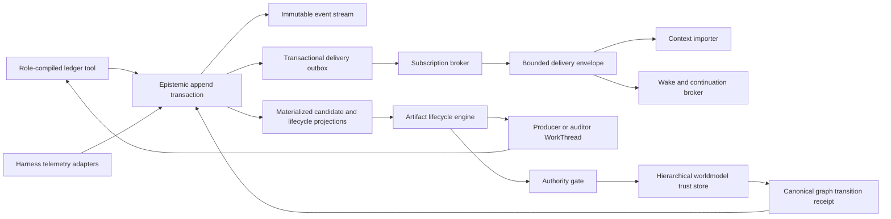

# Direct WorldManager Epistemic Ledger And Semantic CI Spec

Status: implementation-grade design plus a locally regression-proven Direct
foundation for `WM-SC11.1`, restricted worker-native `SC11.2`, partial
`SC11.3`, live bounded runtime dispatch, separately authorized workspace
production, typed lifecycle-result ingestion, and trusted mechanical witness
joins in `SC11.4`-`SC11.6`, production scoped canonical admission in
`SC11.7`, and production unified acceptance in `SC11.8`. The bounded
`WM-SC11` end-to-end completion game is satisfied. Generalized manager ledger
lanes, production delivery debounce, and a true suspended-provider resume
primitive remain explicit follow-on hardening rather than hidden gaps in the
accepted `ImplementationPatch` path.

Date: 2026-08-01.

Implementation posture at this revision:

| Slice | Status | Proven boundary |
| --- | --- | --- |
| `SC11.1` | implemented | Same-control-plane SQLite ledger, global digest chain, stream membership, materialized heads, atomic outbox seeds, topology-independent semantic idempotency with legacy-receipt replay compatibility, restart verification/rebuild, and selected WorldManager event/final-result anchors |
| `SC11.2` | partial/live | Role compiler and closed-world per-call checks are implemented. Exact compiled WorldManager implementation workers receive nine non-authority `ledger_*` operations; their bundle is joined to, but remains distinct from, the static role-lane provider bundle. Calls auto-execute and continue headlessly or with a renderer, without operator approval or workspace authority. The review-auditor lane is live only through exact artifact-constitution assignments; generic manager ledger-provider lanes remain unavailable. |
| `SC11.3` | partial | Durable standings, watches, matching, coalescing primitives, outbox delivery, cursors, acknowledgement, retry, backpressure, and restart state exist. Replay targets only the originally seeded subscriptions and never re-transitions a terminal outbox row. The live default is one bootstrapped Project Manager standing; production append currently flushes each event rather than exercising debounce coalescing. |
| `SC11.4` | partial/live | The production Direct path now provides exact native bounded context import, durable admissions/dispatches/acceptance receipts, restart-safe dedupe, resident-role restoration, idle-role wake, and active-generation safe-boundary deferral followed by automatic drain. It never performs mid-token preemption or polling. A true suspended-provider resume primitive remains unavailable; that posture continues to fail closed. |
| `SC11.5` | partial/live | Pinned constitutions, lifecycles, revisions, producer selection, durable state, and compatibility kernels exist. The service path derives a distinct artifact-constitution start authorization from the exact admitted constitution and producer assignment, compiles the worker context, and starts one authenticated producer WorkThread without fabricating operator acceptance. Headless producer turns can durably request read, patch, and command effects, but every effect remains separately authorized; the artifact lifecycle itself grants no workspace authority. A provider-native `ledger_submit_closure` with `closureKind=artifact_candidate` is joined to the exact authorization/assignment/agent-run binding and registered as an immutable candidate revision through a separate durable ingestion receipt. Registered auditor candidates are routed automatically. |
| `SC11.6` | partial/live | Assurance DAGs, exact-revision audit binding, independence, conditional audits, witness joins, synchronous post-gate revocation, pinned gate-time CAS vectors, exact admission-scope matching, and negative stale-audit games exist. Exact audit assignments start independent, role-compiled auditor WorkThreads. Provider-native typed verdicts are consumed automatically; sibling auditors remain valid across evidence-only lifecycle revisions, while late verdicts after remand/replacement fail closed. `requires_revision` creates typed obligations and re-dispatches the producer; the third remand raises an escalation candidate and wakes the manager through standing. The trusted runtime-evidence adapter binds separately authorized patch/test results and a later repository after-state to the exact producer session, turn, authorization, dispatch, lifecycle, and artifact revision, then authors `source_digest_current` and `focused_test_exit` mechanical witnesses without accepting model self-report as evidence. |
| `SC11.7` | implemented/live | An explicit Project Manager admission request binds the exact gate-ready artifact revision, assurance decision, target scope, actor, and gate-time canonical revision vector to the existing hierarchical-worldmodel trust store. The adapter performs a scope-relative CAS graph transition, persists pending/admitted/failed/stale-CAS receipts, projects receipt-backed authority truth, preserves work-thread-only scope, executes no downstream effects, and reconciles a canonical commit after a crash-before-local-receipt without duplicating the transition. Generic authority-bearing model ledger tools remain disabled. |
| `SC11.8` | implemented/live | One production `ImplementationPatch` path now composes a native Direct producer, separately authorized patch/test effects, trusted runtime witnesses, two independent Direct auditors, gate-time CAS, same-context operator review, an exact typed renderer request through the real Electron preload/IPC/service boundary, Project Manager actor resolution, hierarchical-worldmodel admission, receipt-backed canonical projection, and restart recovery. The same game passes locally and in the network-isolated read-only Docker/Xvfb stack. |

Depends on:

- [World Manager Agent-World And Unified UX](./DIRECT_WORLD_MANAGER_AGENT_WORLD_AND_UNIFIED_UX_SPEC.md)
- [Semantic Context, ARO, And Thought Tools](./DIRECT_WORLD_MANAGER_SEMANTIC_CONTEXT_ARO_AND_THOUGHT_TOOLS_DESIGN.md)
- [ODEU Role-Lane Multi-Agent Architecture](./ODEU_ROLE_LANE_MULTI_AGENT_ARCHITECTURE_SPEC.md)
- [Role-Lane Tool Bundle Composer](./DIRECT_ROLE_LANE_TOOL_BUNDLE_COMPOSER_SPEC.md)
- [Wave 26 Hierarchical Worldmodel](./DIRECT_WAVE26_HIERARCHICAL_WORLDMODEL_PROJECT_MANAGER_SPEC.md)
- [WorldManager Keyboard Pipeline](./DIRECT_WORLD_MANAGER_KEYBOARD_PIPELINE_SPEC.md)

## Purpose

Turn Direct multi-agent coordination from manager-authored conversational
bureaucracy into a role-governed epistemic fabric.

The target is:

```text
agents publish typed changes to shared reason-state
  -> the ledger preserves those changes immutably
  -> constitutional subscriptions determine who must know
  -> the harness delivers bounded projections and wakes roles when needed
  -> artifact constitutions automatically route production, audit, remand,
     admission, and escalation
  -> orchestrators reason when semantic standing changes, not for every
     token-level handoff
```

The compact doctrine is:

> `patch` makes code-state deltas first-class. `ledger` makes reason-state
> deltas first-class.

and:

> The orchestrator declares what kind of artifact must survive what kind of
> scrutiny. The harness realizes that law, while the ledger calls higher-level
> reasoning only when the artifact's semantic standing changes.

This is semantic CI:

```text
traditional CI:
  code patch -> build -> tests -> merge gate

semantic CI:
  typed artifact -> required witnesses -> role-appropriate audits
  -> authority gate -> scope-relative canonical admission
```

## Root Distinctions

### The ledger is not a transcript or log scavenger

A raw log answers:

```text
what bytes or messages appeared, and when?
```

The epistemic ledger answers:

```text
what typed semantic act occurred?
which object did it concern?
what standing does it currently have?
which evidence and revision does it cite?
who was entitled to perform that act?
which contexts and artifact lifecycles are affected?
```

Raw transcripts, command output, tool telemetry, files, and provider events
remain evidence substrates. They are referenced by exact digest-bearing refs;
they are not copied indiscriminately into the semantic ledger.

### Event history is not canonical truth

SC11 preserves three distinct layers:

```text
append-only epistemic event ledger:
  what was observed, proposed, challenged, audited, authorized, or admitted

materialized epistemic projections:
  current candidate standing, lifecycle posture, delivery state, and gate state

canonical hierarchical worldstate:
  the currently admitted semantic state under existing custody and trust law
```

The ledger may contain mutually incompatible claims. The canonical worldmodel
must not.

```text
event appended
!= claim supported
!= artifact audited
!= transition authorized
!= worldstate admitted
```

The existing hierarchical-worldmodel trust store and graph-transition law
remain the authority-bearing canonical writer. SC11 does not create a second
worldstate.

### Delivery and attention are separate transitions

These stages must never be collapsed:

```text
event appended
  -> subscription matched
  -> delivery envelope committed
  -> recipient cursor advanced
  -> bounded payload imported into operational meta-context
  -> recipient model awakened or continued
```

A role can be entitled to receive notice without being entitled to inspect the
underlying evidence. A delivery can be queued without waking a model. A model
can be awakened with an exact bounded delta without receiving the whole stream.

### Semantic and mechanical authorship remain distinct

The harness may author mechanically knowable facts:

```text
tool call started or completed
exit code observed
file-effect digest changed
artifact row persisted
audit requirement became satisfied
delivery was queued or acknowledged
token and time usage observed
```

A semantic role authors interpretations:

```text
observation meaning
claim or hypothesis
contradiction
blindspot
audit assessment
closure proposal
policy or project delta proposal
```

The harness must not counterfeit semantic authorship by translating telemetry
into claims such as “implementation succeeded.” The model must not counterfeit
mechanical evidence by asserting a test or mutation occurred without a witness.

## Existing Substrate And Non-Destructive Alignment

SC11 extends current Direct objects rather than replacing them.

| Existing substrate | Current truth | SC11 alignment |
| --- | --- | --- |
| `wm_events` | Digest-linked WorldManager ingress, settlement, role, result, reconciliation, and presentation lineage with a closed event-kind set | Keep as the WorldManager conversation/control journal; link it to generalized epistemic events through exact refs rather than expanding it into a universal bus |
| `wm_candidate_artifacts` and typed semantic stores | Candidate indexes plus dedicated OpenDecision, ARO, realization, verification, and project-genesis objects | Register exact existing artifact revisions in lifecycle instances; do not duplicate their bodies |
| `direct_meta_orchestrator_*@1` shadow objects | Shallow implementation-evidence/audit routing and transition-law proof without autonomous continuation | Adapt as compatibility inputs to generalized artifact constitutions, assurance graphs, and lifecycle gates |
| `DirectRoleLaneToolBundleComposer` | Compiles role-scoped provider tool declarations and capability catalogues | Compile the role-specific `ledger` operation subset through the same path |
| async-work registry | Typed long-running work registration and completion conditions | Treat lifecycle production/audit jobs as registered async work where appropriate |
| wakeup/continuation objects | Suspension, queued wake event, and bounded continuation packet substrate | Reuse for subscription wake delivery; add epistemic reason/ref bindings rather than inventing a second wake mechanism |
| semantic context importer | Exact shelf/object selection, omission witness, budget, cache, and request-manifest linkage | Hydrate ledger deliveries and subscription deltas through this importer |
| hierarchical worldmodel trust store | Canonical graph custody and revisioned admission | Remains the only SC11 path by which an epistemic event can cause canonical worldstate change |

The first implementation stays in the existing WorldManager SQLite custody and
transaction domain. It may use a logically separate store class, but it must
not create a second user-selectable database or independent source of truth.
Future substrate porting remains a constitutional operation over the same
semantic identities.

## Architecture



The append transaction writes the semantic event, current lifecycle projection,
and delivery outbox rows atomically. Provider calls, audit execution, and
canonical graph commits happen outside that SQLite transaction and return as
new exact events. No database lock remains open across model or tool work.

## Canonical SC11 Objects

### `EpistemicLedgerEvent`

```ts
type EpistemicLedgerEvent = {
  schema: "direct_epistemic_ledger_event@1";
  ledgerEventId: string;
  globalSequence: number;
  streamRefs: LedgerStreamRef[];

  actTypeRef: ExactRef;              // registered semantic-act constitution
  actClass:
    | "observation"
    | "proposal"
    | "challenge"
    | "assessment"
    | "request"
    | "authorization"
    | "admission"
    | "retraction"
    | "mechanical_witness";

  authorshipKind: "semantic_role" | "harness_mechanical" | "operator";
  actorRef: ExactRef;
  roleLaneRef: ExactRef;
  agentRunRef?: ExactRef;
  subjectScope: SemanticScope;

  objectRefs: ExactRef[];
  artifactLifecycleRef?: ExactRef;
  evidenceRefs: ExactRef[];
  affectsRefs: ExactRef[];
  sourceEventRefs: ExactRef[];
  expectedRevisionVector: ScopedRevisionRef[];

  epistemicPosture:
    | "observed"
    | "candidate"
    | "challenged"
    | "supported"
    | "contradicted"
    | "remanded"
    | "admitted"
    | "superseded"
    | "stale";
  authorityPosture:
    | "descriptive"
    | "proposal_only"
    | "scoped_authority_act"
    | "canonical_admission_receipt";

  typedPayloadSchema: string;
  typedPayload: Record<string, unknown>;
  rendererSafeSummary: string;
  idempotencyKey: string;
  previousLedgerDigest: string;
  eventDigest: string;
  createdAt: string;

  rawChainOfThoughtIncluded: false;
  rawSecretIncluded: false;
};
```

The schema governs form, identity, scope, revision, provenance, and authority.
It does not reverse-validate the truth or vocabulary of semantic content.

`actTypeRef` points to a versioned `LedgerActTypeConstitution`. New semantic act
types can therefore be admitted without turning one source-code enum into the
ontology of all possible reasoning. A role receives only operations whose act
types its compiled constitution permits.

### `LedgerStreamRef`

One immutable event can belong to several logical streams:

```text
world:<user-world-id>
project:<project-id>
workthread:<work-thread-id>
artifact:<artifact-lifecycle-id>
agent-run:<agent-run-id>
```

Streams are indexes over the one global sequence, not independent copies.
Cross-stream identity is therefore exact and deduplicated.

### `LedgerWriteReceipt`

Every semantic ledger tool returns a small truthful receipt:

```ts
type LedgerWriteReceipt = {
  schema: "direct_ledger_write_receipt@1";
  ledgerEventRef: ExactRef;
  appendState: "appended" | "idempotent_replay";
  epistemicPosture: string;
  canonicalEffect: false;
  affectedContextRefs: ExactRef[];
  lifecycleTransitionRefs: ExactRef[];
  deliveryDispatchState: "none" | "outbox_committed";
  rendererSafeSummary: string;
};
```

An authority-bearing method may later return a separate exact graph admission
receipt. Ordinary writes always report `canonicalEffect: false`.

### `MaterializedEpistemicProjection`

This rebuildable projection provides current query speed:

```text
claim standing by exact object/revision
artifact lifecycle and assurance posture
active blockers and contradictions
pending authority requests
subscription delivery posture
context invalidation posture
```

It is derived from ledger events and exact external receipts. Corruption blocks
new transitions but does not erase immutable evidence; restart repair rebuilds
the projection from the ledger.

## Role-Governed `ledger` Tool Family

The conceptual namespace is `ledger.*`. Provider-safe function names may use
`ledger_publish_observation`, `ledger_propose_claim`, and so on.

There is no unrestricted `ledger.write`.

### Common semantic operations

```text
ledger.publish_observation
ledger.propose_claim
ledger.attach_evidence
ledger.raise_contradiction
ledger.raise_blocker
ledger.request_authorization
ledger.report_progress
ledger.submit_candidate_artifact
ledger.submit_closure
ledger.retract_candidate
ledger.ack_delivery
ledger.import_delivery_context
```

### Auditor operations

```text
ledger.challenge_claim
ledger.request_evidence
ledger.submit_audit_verdict
ledger.validate_closure_candidate
```

### Scoped manager operations

```text
ledger.activate_artifact_request
ledger.assign_obligation
ledger.remand_artifact
ledger.admit_project_delta
ledger.resolve_project_scope
```

### WorldManager operations

```text
ledger.resolve_world_scope
ledger.admit_canonical
ledger.supersede_canonical
ledger.authorize_transition
ledger.admit_artifact_type_constitution
ledger.modify_policy
```

### Watch operations

```text
ledger.create_watch
ledger.revise_watch
ledger.remove_watch
```

Constitutional subscriptions are compiled by the harness and cannot be removed
by a recipient through a watch operation.

### Rights are separate

The rights vocabulary is:

```text
observe
propose
challenge
assess
admit
authorize
execute
subscribe
acknowledge
```

A role may read a claim without revising it, challenge it without executing,
admit a scoped artifact without authorizing its external consequences, or
receive a notification without gaining access to the cited evidence.

| Role lane | Typical ledger rights | Explicitly absent by default |
| --- | --- | --- |
| implementation worker | observe bounded context; publish observations; propose claims; attach evidence; raise blockers; request authority; submit candidate/closure | canonical admission, policy mutation, auditor verdict, recipient selection |
| review auditor | observe exact audit packet; challenge; request evidence; assess; submit verdict | code mutation, producer self-certification, canonical admission |
| Project Manager | observe project streams; activate project artifact requests; assign obligations; remand; admit project-scoped deltas where custody permits | world policy mutation, unrelated-project access, object-level audit by substitution |
| WorldManager | world/project scope settlement; constitution admission; canonical authority acts under trust-store law; supersession and exception resolution | ordinary worker execution, silent evidence fabrication, implicit cross-scope access |
| watcher/daemon | publish mechanically witnessed events under a fixed adapter identity | semantic interpretation, admission, policy mutation |
| harness | validate, persist, route, materialize, enforce, and author mechanical witnesses | semantic truth authorship or authority beyond exact compiled law |

Tool absence is the first capability boundary. Every call still receives
runtime validation of actor identity, role constitution, scope, expected
revision, evidence visibility, idempotency, and operation-specific invariants.

## Tool Call Semantics

Example:

```text
ledger.propose_claim {
  object_ref: "aro:selector_model@41",
  expected_revision_vector: ["project:arcagi3@91"],
  claim_type: "operator_hypothesis",
  proposed_delta: {
    prior: "selector_transfer",
    candidate: "rigid_translation_with_rebinding"
  },
  evidence_refs: ["run:vc34/frame:12-16"],
  entitlement: "supported",
  affects_refs: [
    "planner:selector_branch",
    "perception:identity_obligation"
  ]
}
```

The runtime checks:

```text
the object and revision exist
the caller may propose this act type in this scope
the cited evidence is visible to the caller
the transition preserves required structural invariants
the idempotency key is unused or an exact replay
the affected refs are well formed
```

It does not decide whether the hypothesis is semantically correct. It appends a
candidate act, materializes its current posture, and commits any required
delivery envelopes.

The operation name carries the illocutionary force. A proposal cannot be
silently treated as admission merely because its prose sounds confident.

### Turn completion and final-message anchoring

Incremental ledger acts let other roles learn before a worker turn ends. The
terminal assistant message still anchors what the role claims the turn
achieved.

```text
during turn:
  observations, evidence, blockers, contradictions, progress, candidates

at terminal boundary:
  final AgentResult
  + exact final-message ref
  + ledger-event range produced by the run
  + mechanical telemetry/effect refs
  + unresolved obligation refs
  -> TurnClosureEnvelope
```

The harness constructs the envelope mechanically from exact refs; it does not
reinterpret the final prose. A `ledger.submit_closure` act may state the role's
semantic completion claim. If no valid closure act exists, the terminal result
is still preserved but the lifecycle remains `closure_unsettled`; it does not
silently become successful completion. Managers can therefore subscribe to
incremental material events and receive one joined closure payload without
scavenging the transcript or waiting blindly for a thread to disappear.

## Notification Standing And Subscriptions

### Constitutional subscription

A `NotificationStanding` is admitted policy about what a role must receive.

```ts
type NotificationStanding = {
  schema: "direct_notification_standing@1";
  standingId: string;
  subscriberRoleRef: ExactRef;
  subscriberScope: SemanticScope;
  sourceStreamPatterns: string[];
  eventActTypeRefs: ExactRef[];
  epistemicPostures: string[];
  objectScopeRefs: ExactRef[];
  materialityPredicateRef: ExactRef;
  deliveryPolicy:
    | "immediate_delta"
    | "safe_boundary"
    | "coalesced_digest"
    | "terminal_only";
  wakePolicy:
    | "never"
    | "if_suspended"
    | "if_material"
    | "always_new_run";
  coalescingPolicyRef: ExactRef;
  evidenceVisibilityPolicyRef: ExactRef;
  revision: number;
  canonical: true;
};
```

Examples:

```text
Project Manager must receive:
  artifact remands, supported audit joins, project authority requests,
  project-scope premise contradictions

WorldManager must receive:
  cross-project invariant conflict, policy conflict, repeated remand
  escalation, world-scope admission request

worker must receive:
  contradiction of a premise pinned into its current constitution,
  authority response for its own request, audit remand on its artifact
```

The producer declares subject scope, affected refs, and materiality evidence.
It does not authoritatively choose recipients. The broker derives recipients
from admitted notification standing.

### Discretionary watch

A `DiscretionaryLedgerWatch` is optional attention requested by an agent or
operator within already-readable scope. It cannot widen read authority,
override a constitutional subscription, or create an always-wake firehose.

### Delivery contract

```ts
type LedgerDeliveryEnvelope = {
  schema: "direct_ledger_delivery_envelope@1";
  deliveryId: string;
  subscriptionRef: ExactRef;
  recipientRoleRef: ExactRef;
  recipientAgentRunRef?: ExactRef;
  eventRefs: ExactRef[];
  boundedProjection: Record<string, unknown>;
  hydrationRequirementRef?: ExactRef;
  deliveryPosture:
    | "queued"
    | "delivered"
    | "acknowledged"
    | "superseded"
    | "failed";
  wakeEligible: boolean;
  cursorBefore: number;
  cursorAfter: number;
  idempotencyKey: string;
};
```

Guarantees for SC11:

```text
event append:
  exactly once per semantic idempotency key

outbox creation:
  atomic with event append and materialized projection update

delivery:
  at least once with exact delivery-id dedupe

acknowledgement:
  monotonic per subscription cursor

ordering:
  global ledger order is stable; delivery order is stable per subscription

payload:
  bounded projection plus refs, never an ambient raw-stream dump
```

## Context Import, Invalidation, And Wakeup

The broker does not stuff arbitrary events into an active prompt. It emits a
typed delivery whose hydration requirement is resolved by the existing
semantic context importer.

```text
delivery envelope
  -> validate recipient visibility and exact refs
  -> IMPORT_CONTEXT for the bounded delivery purpose
  -> create ContextAdmissionEnvelope
  -> attach it at a safe continuation boundary
```

### Active-run policy

```text
recipient is currently generating:
  queue and coalesce; inject only at a supported safe boundary

recipient is suspended awaiting work:
  adapt to DirectAgentWakeEvent + TypedContinuationPacket

recipient is idle but role-resident:
  update semantic inbox; wake only if policy says the event is material

recipient run is terminal:
  do not resurrect it; deliver to the role inbox or start a new run only when
  the admitted wake policy authorizes that transition
```

SC11 does not require mid-token interruption. Unsupported preemption must be
reported as queued delivery, not simulated.

### Live premise invalidation

Every compiled agent world already cites exact worldstate and context
revisions. SC11 adds a `ContextInvalidationNotice` when a new event materially
contradicts or supersedes a pinned premise.

```text
shared premise contradicted
  -> determine affected agent-world manifests mechanically from refs
  -> mark relevant context binding stale
  -> pause before an affected action class
  -> deliver contradiction and exact evidence refs
  -> recipient acknowledges, revises, remands, or explicitly justifies
     continued work under the governing policy
```

An unrelated project event must not invalidate the run. Staleness is a
dependency relation, not a global “something changed” bit.

### Storm control

Subscription policies must define:

```text
debounce window
maximum events per delivery
coalescing key
priority/materiality threshold
maximum wake frequency
supersession behavior
```

Ten progress events may produce one digest. A contradiction, authority denial,
or terminal audit verdict may bypass ordinary coalescing. Backpressure is
visible and must never be rendered as successful delivery.

## Artifact Constitutions And Semantic CI

### `ArtifactTypeConstitution`

An orchestrator governs artifact classes declaratively:

```ts
type ArtifactTypeConstitution = {
  schema: "direct_artifact_type_constitution@1";
  artifactTypeId: string;
  semanticScope: SemanticScope;
  producedObjectKindRefs: ExactRef[];
  producerEligibilityRef: ExactRef;
  requiredMechanicalWitnesses: MechanicalWitnessRequirement[];
  requiredSemanticAudits: AuditRequirement[];
  conditionalAuditRules: ConditionalAuditRule[];
  auditorIndependenceRuleRef: ExactRef;
  lifecycleGatePolicyRef: ExactRef;
  admissionAuthorityRef: ExactRef;
  remandPolicyRef: ExactRef;
  escalationPolicyRef: ExactRef;
  notificationStandingRefs: ExactRef[];
  budgetPolicyRef: ExactRef;
  assuranceRootPolicyRef: ExactRef;
  revision: number;
  canonical: true;
};
```

An artifact-type constitution is itself canonical policy and therefore
requires the existing authority path for its scope. A model cannot create a
new lifecycle law merely by including one in output prose.

### Lifecycle instance and revision

```ts
type ArtifactLifecycleInstance = {
  schema: "direct_artifact_lifecycle_instance@1";
  lifecycleId: string;
  artifactTypeConstitutionRef: ExactRef; // pins exact revision
  requestRef: ExactRef;
  subjectScope: SemanticScope;
  producerAssignmentRef?: ExactRef;
  currentArtifactRevisionRef?: ExactRef;
  assuranceGraphRef: ExactRef;
  gateDecisionRef?: ExactRef;
  state:
    | "requested"
    | "under_production"
    | "candidate"
    | "under_audit"
    | "remanded"
    | "gate_ready"
    | "admission_pending"
    | "admitted"
    | "rejected"
    | "superseded"
    | "stale";
};
```

Each `ArtifactRevision` binds the exact artifact digest, producer run,
constitution revision, evidence refs, and predecessor. An audit applies to one
exact artifact revision. Any artifact revision invalidates earlier audit joins
unless the audit constitution explicitly declares reusable invariant evidence.

The instance pins the constitution revision under which it started. Updating
the artifact-type constitution affects new instances. An active instance moves
to a new constitution only through an explicit migration transition with a
visible witness.

### Lifecycle

```text
ArtifactRequest<X>
  -> harness resolves eligible producer
  -> compile producer AgentWorld and WorkThread
  -> candidate artifact X@revision
  -> evaluate mechanical witness requirements
  -> resolve required and conditional audits
  -> compile independent auditor AgentWorld(s)
  -> exact-revision AuditAssessment(s)
  -> assurance graph join
     ├─ requires revision -> remand producer with typed obligations
     ├─ contradicted -> reject or escalate
     └─ supported -> authority gate
  -> admission authority acts
  -> scope-relative admission receipt
  -> bounded subscribed result delivered to orchestrator
```

The orchestrator need not narrate any of these routings once the constitution
is admitted.

### Assurance graph

Audit requirements form a DAG rather than one Boolean:

```text
candidate revision
├─ mechanical witness: source digest current
├─ mechanical witness: focused test exit captured
├─ semantic audit: contract conformance
└─ semantic audit: regression risk
   └─ conditional specialist audit when governed action class is external
```

The lifecycle compiler rejects cycles before activation. Audits may themselves
be typed artifacts, but each constitution declares an assurance root so audit
of audit does not recurse without limit. Examples of roots are deterministic
schema/digest validation, a specifically authorized human decision, or a
trusted auditor verdict under a bounded constitution.

### Auditor selection and independence

The producer does not choose its auditor unless the constitution explicitly
permits a nominated-reviewer pattern. The harness resolves an eligible auditor
from:

```text
required audit type
AgentClassSpec and role-lane fit
project and evidence visibility
substrate availability
independence constraints
current load and budget
conflict-of-interest refs
```

The selection receipt is inspectable and grants only the audit capabilities
required for the exact artifact revision.

### Gate law

An artifact becomes `gate_ready` only when:

```text
the exact current artifact digest remains current
every mandatory mechanical witness is present and valid
every mandatory semantic audit has a supported standing
every conditional audit predicate has been evaluated
no unresolved blocking contradiction or remand obligation remains
budget and retry/remand policy have not forced escalation
the required authority role is resolvable
```

`gate_ready` is not `admitted`.

Admission is scope-relative:

```text
accepted as WorkThread evidence
!= admitted as project memory
!= admitted as canonical project state
!= admitted as user-world policy
```

Each gate decision names its target scope and authority. A Project Manager may
admit a project-local closure where its custody permits; only the WorldManager
or operator-backed authority path may admit world-scope policy.

### Remand and escalation

A remand creates typed obligations and preserves the candidate revision as
history. It does not rewrite the artifact in place.

```text
remand count below policy threshold:
  route obligations to eligible producer revision

repeated identical remand, audit disagreement, budget exhaustion,
authority ambiguity, or cross-project conflict:
  escalate to the subscribed manager/orchestrator
```

The manager receives the relevant joined payload only at this semantic
boundary, not every worker message.

## First Vertical Slice: `ImplementationPatch`

The first live SC11 lifecycle should use one project-local
`ImplementationPatch` because current Direct already has exact ARO contracts,
worker constitutions, patch/command authority, execution evidence, and semantic
verification candidates.

Recommended constitution:

```text
producer:
  implementation_worker bound to one project / WorkThread / exact ARO contract

mechanical witnesses:
  worker turn terminal
  workspace effect accounted for
  repository-after digest captured
  required focused command/test evidence present

semantic audits:
  semantic-contract conformance
  regression/preservation coverage

auditor:
  review_auditor distinct from producer agent run

admission target:
  WorkThread closure evidence first

admission authority:
  Project Manager under the existing project-custody policy

WorldManager wake conditions:
  cross-project impact, policy conflict, repeated remand, unresolved authority,
  or requested promotion beyond project scope
```

SC11 must adapt existing SC8.3 through SC8.5 artifacts by exact refs. It must not
copy their source excerpts, invent test success, or treat the SC8.5
`ready_for_review` candidate as canonical admission.

## Persistence Plan

First-slice tables in the existing WorldManager SQLite database:

```text
wm_epistemic_events
wm_epistemic_event_stream_memberships
wm_epistemic_projection_heads
wm_ledger_act_type_constitutions
wm_ledger_write_receipts

wm_notification_standings
wm_discretionary_ledger_watches
wm_ledger_delivery_outbox
wm_ledger_deliveries
wm_ledger_subscription_cursors
wm_context_invalidation_notices

wm_artifact_type_constitutions
wm_artifact_lifecycle_instances
wm_artifact_revisions
wm_artifact_producer_assignments
wm_artifact_audit_requirements
wm_artifact_audit_assignments
wm_artifact_audit_assessments
wm_artifact_assurance_graphs
wm_artifact_gate_decisions
wm_artifact_remand_obligations
wm_artifact_admission_receipts
```

Bodies remain in their owning typed stores. Registry and lifecycle rows carry
exact refs, digests, posture, sequence, and timestamps.

SQLite requirements:

```text
WAL remains enabled
foreign keys remain enabled
append, projection update, and delivery-outbox creation share one transaction
global sequence is monotonic
previous-ledger digest forms a restart-verifiable chain
idempotency keys are unique within actor/operation scope
projection heads are rebuildable
terminal provider/tool uncertainty is never auto-replayed
```

Canonical worldmodel admission may currently cross a separate trust-store
commit boundary. SC11 uses a receipt protocol:

```text
gate-ready event committed
  -> authority service attempts exact CAS graph transition
  -> graph transition receipt or failure is persisted
  -> ledger appends admission-observed or admission-failed event
```

Until one transactional store owns both sides, the UI must represent the
intermediate `admission_pending` state. It must never infer canonical success
from a gate request alone.

The production adapter uses the existing hierarchical graph as the only
canonical state. A gate pins the current exact scoped revision. The later
Project Manager admission writes a durable pending receipt before crossing the
store boundary, performs the exact CAS, and records either the graph-transition
receipt or a typed failure/stale-CAS receipt. A deterministic transition ID and
durable trust-store admission permit retry to reconcile a graph commit that
completed before the local success receipt was written.

## Concurrency And Revision Law

Every semantic mutation cites an expected revision vector for all governed
objects it changes.

```text
exact current revisions:
  accept append or authority attempt

stale but structurally mergeable telemetry:
  append as new evidence without changing semantic claim standing

stale semantic proposal or admission:
  reject/remand with current refs; never auto-rebase meaning

multi-object canonical admission:
  compare-and-swap all governed revisions or admit none
```

Evidence refs are immutable and preferably content-addressed. Reuse requires a
freshness policy attached to the artifact/audit constitution; matching labels
or filenames are insufficient.

## Privacy, Security, And Inspection

SC11 persists stable typed acts and witnesses, not private chain-of-thought.

Inspectable content includes:

```text
role and scope selection
semantic act type
claim/assessment summary
exact evidence refs
policy and constitution refs
delivery standing and route
audit requirements and verdicts
authority/gate transition
worldstate delta and admission receipt
```

It excludes:

```text
raw hidden reasoning
ambient full transcripts
unbounded command output
secret-bearing tool payloads
evidence a recipient is not authorized to read
```

A notification may say that a protected contradiction exists and that the
recipient must pause, while withholding the protected evidence body. Read,
subscribe, and hydrate rights remain separate.

## Morphic UX Contract

### Run stance

```yaml
task_mode: design
execution_mode: standard
grounding:
  doctrine: borrowed
  reference_family: borrowed
  host_repo: repo_grounded
  implementation: static_inspected
  runtime: local_fixture_and_headless_observed
profile_lineage:
  base_profile: artifact_inspector_alternate
  derivative_profile: worldmanager_epistemic_fabric_v0
  profile_status: proposed_local
```

### Source pack

```yaml
source_pack:
  doctrine_sources:
    - Morphic UX frontend skill
  borrowed_reference_sources:
    - artifact_inspector_advisory_workbench
  host_sources:
    - src/main/direct/worldmanager/control-plane-store.js
    - src/main/direct/worldmanager/semantic-artifact-kernel.js
    - src/main/direct/worldmanager/semantic-context-kernel.js
    - src/main/direct/bridge/meta-orchestrator-shadow.js
    - src/main/direct/bridge/role-lane-tool-bundle-composer.js
    - src/main/direct/worldmodel/async-work-registry.js
    - src/main/direct/worldmodel/wakeup-continuation.js
  related_specs:
    - DIRECT_WORLD_MANAGER_AGENT_WORLD_AND_UNIFIED_UX_SPEC.md
    - DIRECT_WORLD_MANAGER_SEMANTIC_CONTEXT_ARO_AND_THOUGHT_TOOLS_DESIGN.md
    - ODEU_ROLE_LANE_MULTI_AGENT_ARCHITECTURE_SPEC.md
  runtime_observations:
    - same-database restart and digest-chain regression
    - native worker ledger tool execution and continuation regression
    - artifact assurance/admission negative games
    - headless Electron lifecycle and delivery-truth regression
```

### `ux_domain_packet`

```text
primary user:
  expert operator who normally wants one calm unified relationship

risk:
  high when an artifact can cause workspace, remote, policy, or canonical
  worldstate effects

trust sensitivity:
  provenance, epistemic standing, audit independence, delivery truth, and
  authority boundaries

utility ranking:
  semantic focus
  low default cognitive load
  early blocker visibility
  inspectable causality
  operator intervention only at meaningful boundaries

evidence visibility:
  required evidence and gate sources same-context reachable before admission
```

### `ux_morph_ir`

Invariants:

```text
one visible event maps to one exact ledger identity at every depth
candidate, challenged, supported, remanded, gate-ready, and admitted differ
delivery queued, delivered, imported, and awakened differ
worker submission never looks like auditor certification
auditor certification never looks like canonical admission
the UI expresses authority but never creates it
required evidence remains same-context reachable before authority acts
```

Morphable:

```text
timeline, graph, tree, or compact card projection
inline status versus focused inspector
project panel versus global activity dock placement
coalesced progress density
desktop split versus narrow stacked arrangement
```

Axes:

```text
density = medium by default, high in focused lifecycle inspection
navigation_mode = simultaneous context with object-centered focus expansion
information_posture = status first, evidence on same-context demand
interaction_tempo = calm event-driven default with expert fast path
salience_posture = blockers, authority requests, remands, and admissions prominent
state_exposure = progressive but explicit
command_posture = safe advisory lane separated from authority/commit lane
```

### `ux_surface_projection`

```text
unified conversation region:
  outcomes and only material lifecycle transitions

operational ribbon:
  active scope, subscribed changes, stale-context posture, pending authority

project activity region:
  concise artifact lifecycle and audit posture per project

focused artifact workbench:
  lifecycle graph
  producer/auditor provenance lane
  evidence and assurance lane
  remand/blocker lane
  explicit authority gate

semantic anatomy depth:
  exact ledger event, subscription route, context import, role constitution,
  tool/telemetry witnesses, and canonical receipt
```

The ordinary user should see “audit in progress,” “needs your authority,” or
“admitted,” not a firehose of internal events. Selecting the status opens the
same artifact identity in the focused workbench.

Artifact inventory:

| Surface artifact | Decision | Host-owned semantics |
| --- | --- | --- |
| SC10 unified conversation and anatomy | compose | Preserve one event identity and calm default disclosure |
| semantic event/activity projection | build | Coalesce ledger acts without hiding blockers, authority requests, remands, or admission truth |
| artifact lifecycle graph | build | Project the exact lifecycle/assurance graph; never infer state from card order or color |
| SC8 evidence workbenches | import and align | Keep exact source/effect/verification evidence same-context reachable |
| Decision Dock and typed action regions | compose | Preserve existing semantic-region binding and revision gates |
| authority gate surface | build | Separate advisory/remand actions from scope-relative canonical admission |
| raw log viewer | import on demand | Remain secondary substrate evidence; never become the default coordination surface |

### `ux_interaction_contract`

| Interaction | Preconditions | Visible consequence | Semantic/authority effect |
| --- | --- | --- | --- |
| inspect lifecycle | exact artifact lifecycle ref | focused same-context lifecycle workbench | none |
| inspect delivery route | exact event and delivery refs | standing, recipient, cursor, and hydration witness shown | none |
| acknowledge notice | recipient and current delivery revision | delivery becomes acknowledged | no object/world authority |
| request revision | exact artifact revision and permitted manager role | typed remand obligations become visible and routed | lifecycle transition only |
| approve admission | gate-ready exact revision, evidence reachable, current authority | explicit pending then admitted/failed posture | authority service may attempt scoped canonical transition |
| add discretionary watch | readable source scope and watch budget | watch appears separately from constitutional standing | attention only; no read/authority widening |

Unavailable authority controls remain visible with their missing prerequisite.
No success styling appears for unknown delivery, pending admission, stale audit,
or conflicted assurance.

Responsive preservation:

```text
wide:
  lifecycle/assurance graph and evidence/gate lanes remain simultaneously visible

mid-width:
  object-centered focus expansion may cover lower-priority activity summaries

narrow:
  lanes stack inside the same bounded workbench; evidence remains reachable
  before the authority control without a route transition

never:
  hide required evidence behind admission, fragment a primary assurance graph
  when it can fit through bounded focus, or remove stale/conflict posture
```

## Runtime Components

Implemented Direct-owned foundation modules:

```text
src/main/direct/worldmanager/epistemic-ledger-kernel.js
  schemas, act-type registry, exact refs, validation, receipts

src/main/direct/worldmanager/epistemic-ledger-store.js
  append chain, stream indexes, materialized heads, outbox, rebuild/recovery

src/main/direct/worldmanager/ledger-tool-compiler.js
  role-compiled tool family and per-call authority adapter

src/main/direct/worldmanager/ledger-subscription-broker.js
  constitutional standing, watches, matching, coalescing, cursors, deliveries

src/main/direct/worldmanager/ledger-context-runtime.js
  IMPORT_CONTEXT hydration, invalidation, safe-boundary injection

src/main/direct/worldmanager/artifact-lifecycle-kernel.js
  type constitutions, instances, revisions, assurance DAG, gate states

src/main/direct/worldmanager/artifact-lifecycle-runtime.js
  producer/auditor resolution, async registration, remand, escalation, receipts

src/main/direct/worldmanager/epistemic-fabric-state-store.js
  durable broker, context, lifecycle, dispatch, invalidation, and receipt state

src/main/direct/worldmanager/epistemic-fabric-runtime.js
  ledger/broker/context/lifecycle composition and fail-closed authority boundary

src/main/direct/worldmanager/epistemic-ledger-projection.js
  renderer-safe global/project/artifact projections and semantic anatomy refs

src/main/direct/controller/live-text-controller.js
  restricted native implementation-worker ledger bundle and automatic tool loop
```

Adapters, not replacements:

```text
wm_events adapter
meta-orchestrator-shadow adapter
SC8 artifact adapter
role-lane tool bundle adapter
async-work registration adapter
wakeup/continuation adapter
hierarchical-worldmodel admission adapter
unified WorldManager projection adapter
```

Focused local proof:

```bash
npm run direct:world-manager-sc11
npm run direct:role-lane-tool-bundle-composer
npm run direct:world-manager-aro-worker-handoff
npm run direct:world-manager-aro-worker-handoff-ui
```

## Implementation Sequence

### `WM-SC11.1` — Epistemic ledger kernel and durable append

Build:

```text
LedgerActTypeConstitution
EpistemicLedgerEvent
LedgerWriteReceipt
global sequence and stream membership
append/projection/outbox transaction
idempotency and digest-chain restart verification
read-only adapters from selected existing WorldManager events
```

Boundary: no provider-declared ledger tools, subscriptions, wakes, artifact
routing, or canonical effect.

### `WM-SC11.2` — Role-compiled ledger tools

Build the common, worker, auditor, Project Manager, and WorldManager operation
sets through the existing role-lane tool-bundle compiler. Enforce per-call
identity, scope, revision, evidence visibility, and idempotency.

Boundary: model ledger tool calls append candidate/assessment/request acts
only. Even after SC11.7, canonical admission is an explicit harness/service
authority transition rather than a generic model ledger operation.

### `WM-SC11.3` — Notification standing and durable delivery

Build constitutional standing, discretionary watches, transactional outbox,
matcher, coalescer, exact delivery envelopes, monotonic cursors, acknowledgement,
retry, and backpressure projection.

Boundary: delivery reaches semantic inboxes; only a later admitted wake policy,
exact recipient binding, and bounded context admission may start provider work.

### `WM-SC11.4` — Context hydration, invalidation, and wake continuation

Integrate delivery envelopes with the semantic context importer, dependency
staleness, async-work suspension, `DirectAgentWakeEvent`, and typed continuation
packets. Prove no polling and no unsupported mid-token preemption.

Boundary: wake resumes or starts only under an admitted wake policy and existing
provider/runtime authority. Active generation is persisted as a retryable
safe-boundary dispatch and is drained only after the role becomes idle.

### `WM-SC11.5` — Artifact constitutions and lifecycle engine

Build artifact-type constitutions, pinned lifecycle instances, exact artifact
revisions, producer assignment, state projection, remand obligations, budget,
and compatibility adapters for meta-orchestrator shadow and SC8 artifacts.

Boundary: the producer WorkThread receives one provider turn under a distinct
artifact-constitution authorization. The lifecycle grants no workspace
mutation, recursive spawn, remote effect, or canonical admission. Local
workspace effects may occur only through their own exact approval obligations;
their observed results do not retroactively widen lifecycle authority.

### `WM-SC11.6` — Assurance DAG and semantic audit routing

Build mechanical witness joins, semantic/conditional audit requirements,
independent auditor resolution, audit WorkThreads, exact-revision verdicts,
cycle rejection, assurance roots, remand routing, and escalation thresholds.

Boundary: auditor WorkThreads receive exact-revision, independence-filtered
assignments. Supported assurance produces `gate_ready`; it does not admit.

### `WM-SC11.7` — Scoped authority gates and canonical admission receipts

Status: implemented and locally regression-proven on the production Direct
service path.

Connect exact gate decisions to existing project/world custody and hierarchical
worldmodel trust-store commits. Persist pending, success, failure, and stale-CAS
receipts. Add multi-object atomic admission where the canonical store supports
it; otherwise fail closed.

Boundary: admission grants only the declared target-scope transition. It does
not automatically execute downstream external effects.

### `WM-SC11.8` — Unified UX and multi-agent acceptance games

Status: implemented and locally plus Docker/Xvfb regression-proven through the
production Electron preload/IPC/service boundary.

Implementation run stance:

```text
task_mode = implementation
execution_mode = standard
grounding_status = repo_grounded
implementation_inspection_status = implementation_inspected

borrowed doctrine/profile = artifact_inspector_reference
local derivative = semantic_ci_unified_workbench
profile status = proposed_local
runtime posture = headless exercised before renderer promotion
```

SC11.8 production closure contract:

```text
one exact ImplementationPatch lifecycle
  -> native Direct producer WorkThread
  -> separately authorized patch and focused test
  -> trusted runtime-evidence witness joins
  -> two independent native Direct auditor WorkThreads
  -> exact gate-ready revision and canonical CAS vector
  -> operator reviews lifecycle, evidence, scope, and authority lineage
  -> typed renderer command cites those exact refs
  -> Project Manager service resolves its own canonical actor
  -> hierarchical-worldmodel trust-store transition
  -> receipt-backed admitted projection

The renderer may request this transition. It cannot select the authority actor,
alter the target scope, omit the gate vector, or infer success from transport
completion. A delivery acknowledgement is never an admission surrogate.
```

Project global/project activity, artifact lifecycle focus, delivery routes,
assurance evidence, remands, and authority gates into the SC10 unified surface.
Add fixture, headless Electron, restart, Docker/Xvfb, concurrency, and negative
authority games.

Delivered acceptance matrix:

| Boundary | Witness |
| --- | --- |
| lifecycle truth | one real gate-ready lifecycle is projected separately from receipt-backed admission |
| evidence and provenance | producer assignment, two independent auditor assignments, mechanical witnesses, exact evidence refs, and assurance standing remain reachable in one focused inspector |
| authority | target scope, admission authority, gate decision, and gate-time canonical revision vector are shown in a distinct authority lane |
| renderer command | two-step review emits one exact request; renderer cannot choose the authority actor or omit reviewed refs |
| negative authority | an incomplete evidence vector fails before canonical mutation and leaves the lifecycle gate-ready |
| real integration | production Electron preload, IPC handler, service authority adapter, and hierarchical-worldmodel trust store are exercised together |
| restart | receipt-backed canonical admission remains visible and non-repeatable after Electron restart |
| isolated executor | the identical Electron game passes under a network-none, read-only-root Docker/Xvfb stack and exports its report and screenshot |

Boundary: the UI remains a renderer and typed-command surface, never a second
state store or authority source.

## Acceptance Games

### Tool and authority boundaries

```text
worker receives propose/attach/block/submit operations but no admit operation
auditor can challenge and submit verdict but cannot patch or self-admit
Project Manager cannot inspect unrelated-project protected evidence
producer-supplied recipient ids are ignored or rejected
runtime rejects a valid-looking call from the wrong role or stale constitution
schema-valid prose cannot inflate proposal into admission
```

### Append and recovery

```text
same idempotency key and body returns exact prior receipt
same key with different body fails visibly
ledger digest-chain corruption blocks writes and permits read-only diagnosis
projection rebuild reaches the same heads
restart drains committed outbox rows without duplicating semantic events
```

### Subscription and attention

```text
constitutional subscriber cannot opt out through discretionary watch tools
watch cannot widen evidence visibility
ten progress events coalesce into one bounded delivery
blocking contradiction bypasses ordinary progress delay
at-least-once redelivery is deduped by delivery id
cursor acknowledgement is monotonic
terminal agent run is not silently resurrected
unsupported mid-turn injection remains queued and visible
```

### Context validity

```text
contradicted pinned premise stales only affected agent worlds
unrelated project update does not pause the worker
delivery hydration imports exact visible refs and records omissions
protected evidence remains withheld while the pause obligation is delivered
recipient can acknowledge/revise/remand without receiving ambient stream history
```

### Artifact lifecycle

```text
ImplementationPatch candidate automatically routes to an eligible independent auditor
audit binds one exact artifact digest
new candidate revision invalidates the old audit join
mechanical green test without semantic audit never becomes gate-ready
semantic green audit without required mechanical witness never becomes gate-ready
conditional external-effect audit activates only when its settled predicate holds
audit dependency cycle is rejected before activation
repeated remand crosses threshold and wakes Project Manager
auditor disagreement escalates rather than averaging verdicts
policy revision does not silently rewrite an active pinned lifecycle
```

### Admission

```text
gate-ready remains visually and semantically non-canonical
stale graph revision rejects admission without semantic auto-rebase
WorkThread-evidence admission does not imply project/world admission
canonical graph receipt is required before admitted styling
failed cross-store authority attempt remains admission_pending/failed, never success
admission event cites exact graph transition and trust-store receipt
```

### UX truth

```text
default conversation shows only material lifecycle posture
focused artifact view preserves evidence, audit standing, and authority gate together
candidate, remanded, gate-ready, pending, and admitted are materially distinct
delivery queued, delivered, context-imported, and awakened are inspectable
inspection performs no semantic or authority mutation
private chain-of-thought is absent at every depth
```

## Non-Goals

SC11 does not authorize:

```text
one unrestricted shared memory object
ambient raw-log or transcript streaming to every agent
private chain-of-thought storage or broadcast
model-selected authoritative notification recipients
worker self-certification or self-admission
orchestrator object-level micro-audit by default
token-by-token inter-agent narration
polling loops when an event subscription can express the condition
provider calls inside database transactions
automatic semantic rebase of stale claims
unbounded recursive audit of audits
global firehose wakeups
cross-machine distributed consensus in the first implementation
replacement of mechanical operation/usage ledgers
replacement of the hierarchical worldmodel trust store
automatic downstream execution merely because an artifact was admitted
```

## Completion Gate

Current result: **satisfied for the bounded `ImplementationPatch` lifecycle**.
The local Direct-controller games now
prove native bounded import, idle wake, active-turn safe-boundary deferral,
restart/idempotency receipts, and constitution-authenticated producer/auditor
WorkThread starts. They also prove provider-native producer-closure and auditor-
verdict ingestion, automatic audit routing, typed remand producer re-dispatch,
stale-sibling rejection after replacement, repeated-remand escalation, durable
ingestion replay/restart, headless separately authorized patch/test execution,
exact repository-after observation, trusted revision-bound mechanical witness
ingestion, assurance progression to `gate_ready`, and an explicit
Project Manager transition through the real hierarchical-worldmodel trust
store. They prove pending/success/failure/stale-CAS receipts, work-thread-only
revision advance, crash-before-local-receipt reconciliation, and restart-safe
receipt-backed canonical projection. The production Electron game composes
those objects through the real preload/IPC/service seam, rejects an incomplete
evidence vector without changing authority state, admits the exact reviewed
revision, and proves the canonical receipt survives restart. The same game
passes in the isolated Docker/Xvfb executor. Generic manager ledger-provider
lanes, production debounce scheduling, and true suspended-provider resume stay
listed as generalized hardening work; they do not silently widen this accepted
artifact constitution.

The live runtime boundary is regression-covered by:

```bash
npm run direct:world-manager-runtime-dispatch
npm run direct:world-manager-lifecycle-ingestion
npm run direct:world-manager-runtime-evidence-bridge
npm run direct:world-manager-canonical-admission
npm run direct:world-manager-sc11-electron
npm run direct:world-manager-sc11-container
npm run direct:world-manager-sc11
```

The runtime-dispatch game uses the real Direct controller with a deterministic
provider transport. It proves five provider activations: one idle Project
Manager wake, one deferred safe-boundary continuation, one producer WorkThread,
and two independent auditor WorkThreads. It also proves exact replay/restart
dedupe and forged-authorization rejection. It intentionally proves
`workspaceMutationAuthorized: false` and `canonicalAuthorityGranted: false`.

The canonical-admission game uses the production WorldManager service,
hierarchical graph, governance registry, and trust store. It pins two candidates
to the same work-thread revision, admits one, rejects the other as stale without
widening project scope, and recovers a committed graph transition after a
simulated crash before the fabric can persist its local success receipt.

The lifecycle-ingestion game runs real Direct producer and auditor turns through
the provider-native ledger tool loop. It proves 12 durable discharge receipts
across candidate registration, exact-revision audit, remand, successor revision,
stale audit rejection, repeated-remand escalation, idempotent replay, and
restart. It intentionally keeps workspace mutation false and never invokes the
available canonical authority adapter automatically.

The runtime-evidence bridge game runs an actual headless producer through a
patch request, focused-test command, and artifact-candidate closure. Patch and
command effects are approved as distinct obligations, never inherited from the
artifact lifecycle. The harness then observes the exact tool results and later
repository state, emits revision-bound `source_digest_current` and
`focused_test_exit` witnesses, routes both semantic auditors, reaches
`gate_ready`, survives restart, and proves that no canonical admission occurs
automatically.

`WM-SC11` is complete only when Direct can prove this end-to-end game:

```text
Project Manager activates one ImplementationPatch lifecycle under an admitted
artifact-type constitution.

The harness compiles and starts an eligible implementation worker. The worker
uses only its role-compiled ledger operations to publish observations,
evidence, blockers, and one exact candidate revision.

The harness joins required mechanical witnesses, resolves an independent
auditor, compiles the auditor's bounded world, and routes the exact candidate
without Project Manager narration or polling.

The auditor submits a typed verdict. A remand returns automatically to the
producer; a supported assurance graph advances to a visible gate-ready state.

The Project Manager receives one bounded subscribed payload at the semantic
boundary, inspects same-context evidence, and performs the permitted
scope-relative admission.

The canonical graph transition receipt is appended and delivered. Restart at
every boundary preserves exact event, artifact, audit, delivery, cursor,
authority, and context lineage without duplicate work or inflated authority.
```

The resulting architecture is:

```text
semantic roles author typed epistemic deltas
harness law persists, routes, hydrates, and wakes
artifact constitutions compile repeatable scrutiny
auditors establish bounded standing
authorities admit at explicit scopes
orchestrators govern exceptions and semantic boundaries
worldstate remains singular and canonical
```
